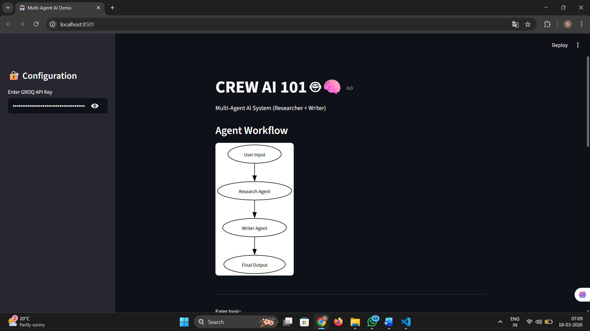
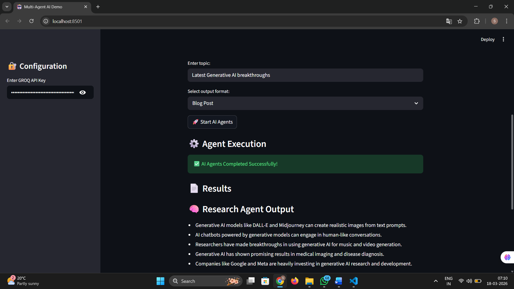
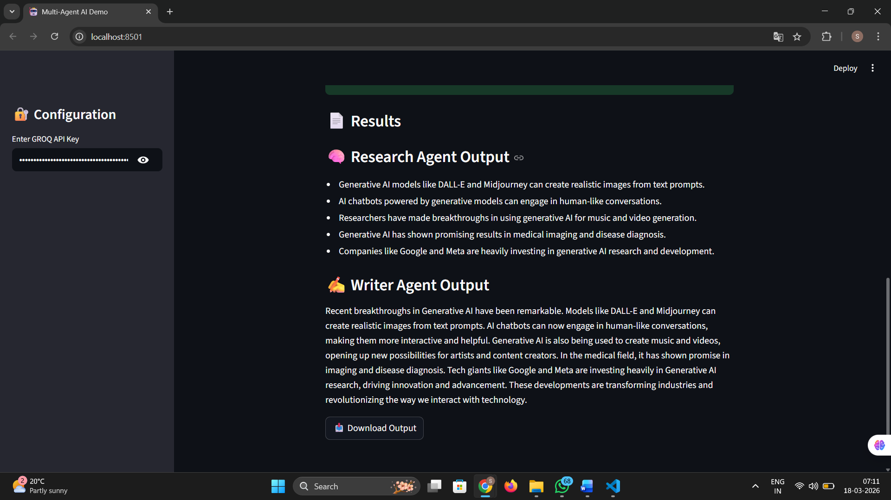

# 🤖 Multi-Agent AI Research Assistant (CrewAI + Groq)

## 📌 Overview

This project is a **Multi-Agent AI System** built using **CrewAI, Groq LLM, and Streamlit**.
It demonstrates how multiple AI agents collaborate to perform a task efficiently.

The system consists of:

* 🧠 **Research Agent** → Gathers key insights
* ✍️ **Writer Agent** → Generates a structured summary

---

## 🚀 Features

* Multi-agent collaboration using CrewAI
* Fast inference using Groq LLM
* Clean Streamlit UI
* Controlled and concise AI output
* Download generated content
* Real-world AI workflow simulation

---

## 🧠 How It Works

1. User enters a topic
2. **Research Agent** extracts 5 key insights
3. **Writer Agent** converts insights into a short structured output
4. Final result is displayed in UI and can be downloaded

---

## 🏗️ Tech Stack

* Python
* CrewAI
* Groq API (LLM)
* Streamlit

---

## 📂 Project Structure

```
CrewAI/
│── app.py
│── requirements.txt
│── README.md
```

---

## ⚙️ Installation & Setup

### 1️⃣ Clone the repository

```bash
git clone https://github.com/your-username/your-repo-name.git
cd your-repo-name
```

### 2️⃣ Create virtual environment

```bash
python -m venv venv
venv\Scripts\activate   # Windows
```

### 3️⃣ Install dependencies

```bash
pip install -r requirements.txt
```

### 4️⃣ Run the application

```bash
streamlit run app.py
```

---

## 🔑 API Setup

### Groq API Key

* Get your key from: https://console.groq.com/keys
* Enter it in the app sidebar

---

## 🎯 Use Cases

* AI-powered content generation
* Research summarization
* Blog/article writing
* Educational AI tools

---

## 🧠 Key Concepts Demonstrated

* Multi-Agent Systems
* Prompt Engineering
* LLM Integration
* Sequential Task Execution

---

## 🚀 Future Improvements

* Add Planner Agent (3-agent system)
* PDF export feature
* Chat history
* Real-time web search integration

---

## ⭐ Acknowledgements

* CrewAI
* Groq
* Streamlit

---

---
# 📸 Demo
    ## 📸 Demo Output

    <p align="center">
    
    </p>

    <p align="center">
    
    </p>

    <p align="center">
    
    </p>
---

## 📌 Note

Do not expose your API keys publicly. Use environment variables for security.
